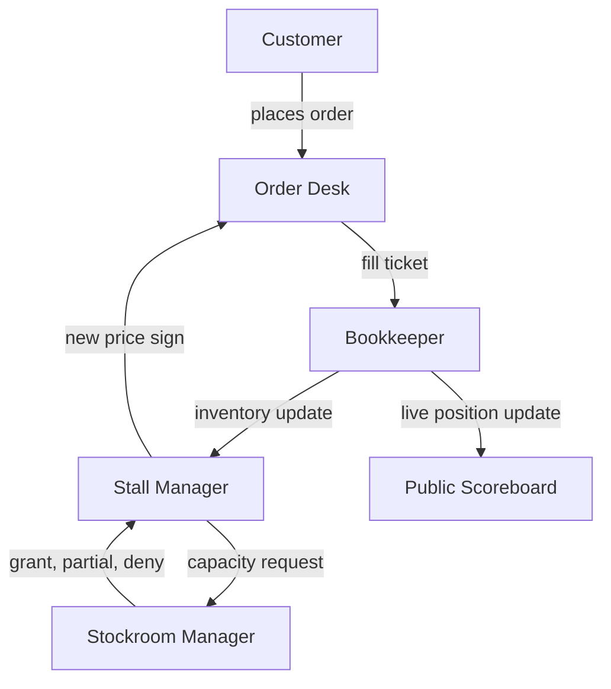
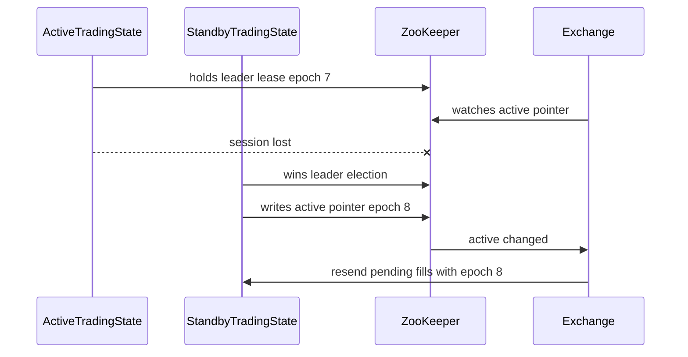

<!-- f23eb344-2b97-47c8-8122-405bd4a60ef2 -->
---
todos:
- id: "draft-outline"
  content: "Create the final paper outline with section titles, page counts, analogy notes, and source references."
  status: pending
- id: "select-diagrams"
  content: "Choose which architecture, workflow, and hot-swap diagrams should appear in the paper."
  status: pending
- id: "write-paper"
  content: "Expand each section using the farmers-market pattern: analogy, technical mapping, failure case, safety mechanism."
  status: pending
- id: "revise-for-audience"
  content: "Review the full draft for clarity, consistent analogy usage, and accurate distributed systems terminology."
  status: pending
  isProject: false
---
# 15-20 Page Paper Plan

## Goal
Write a paper titled something like **“Understanding a Distributed Market Maker Through a Farmers Market”**. The paper should explain the project to a general reader while still showing the real computer science ideas behind it: services, APIs, streaming, coordination, fault tolerance, consistency, and recovery.

Primary source docs:
- [essay draft](C:/Users/shimm/Documents/School/Spring%202026/Capstone/Market-Maker/docs/essay-draft.md)
- [architecture diagram](C:/Users/shimm/Documents/School/Spring%202026/Capstone/Market-Maker/docs/architecture.md)
- [workflow diagrams](C:/Users/shimm/Documents/School/Spring%202026/Capstone/Market-Maker/docs/workflows.md)
- [distributed systems challenges](C:/Users/shimm/Documents/School/Spring%202026/Capstone/Market-Maker/docs/ds-challenges.md)
- [scope and error cases](C:/Users/shimm/Documents/School/Spring%202026/Capstone/Market-Maker/docs/scope.md)
- [API reference](C:/Users/shimm/Documents/School/Spring%202026/Capstone/Market-Maker/docs/api.md)

## Core Analogy
Use the farmers market analogy throughout the entire paper, not only in the introduction.

Map the project elements this way:
- **External Order Publisher**: customers placing orders at the market.
- **Exchange Service**: the central order desk that validates requests and records trades.
- **Trading State Service**: the bookkeeping office that tracks official inventory/positions.
- **Market Maker Nodes**: stall managers who update prices based on current inventory.
- **Exposure Reservation Service**: the stockroom/risk manager who prevents overpromising.
- **Position UI**: the public scoreboard showing live inventory.
- **ZooKeeper**: the badge/manager registry that decides who is in charge when several workers could do the same job.
- **PostgreSQL/Hazelcast**: the durable ledger and fast working notebook.
- **RSocket/HTTP**: phone lines, runners, and message tubes between market buildings.

Suggested high-level diagram for the paper:

## Recommended Paper Structure

### 1. Introduction: Why Distributed Systems Are Like a Busy Market (1-1.5 pages)
Open with a vivid farmers-market scene. Explain that a modern trading system is not one program doing everything, but a coordinated group of independent services. Preview the paper: project goal, major services, workflows, and distributed systems challenges.

Main point: distributed systems are powerful because work can be split across machines, but difficult because machines must communicate, coordinate, and recover from failure.

### 2. Project Purpose: What a Market Maker Does (1-1.5 pages)
Explain market making in plain language: continuously offering to buy and sell, earning the spread, and managing inventory/risk. Use the apple-stall example for bid/ask prices.

Connect the analogy to the real system: quotes, orders, fills, positions, reservations, and quote expiration.

### 3. System Elements and Responsibilities (2-2.5 pages)
Introduce each component as a character in the farmers market, then give its technical role.

Cover:
- Exchange Service: current quotes and external orders.
- Trading State Service: official positions and live streams.
- Market Maker: quote calculation and publishing.
- Exposure Reservation: risk limits and capacity grants.
- Position UI: real-time monitoring.
- External Order Publisher: simulated customer order flow.
- ZooKeeper cluster: leader election and assignment coordination.
- Database/storage layer: persistent record keeping.

Use [architecture diagram](C:/Users/shimm/Documents/School/Spring%202026/Capstone/Market-Maker/docs/architecture.md) as the technical backbone.

### 4. Workflow One: Submitting an External Order (2 pages)
Tell the story of a customer buying apples from a posted sign. Then map the story to the Exchange receiving `POST /orders`, validating the quote, checking expiration, checking price, adjusting quantity, creating a fill, and sending the fill to Trading State.

Include edge cases from [workflow diagrams](C:/Users/shimm/Documents/School/Spring%202026/Capstone/Market-Maker/docs/workflows.md):
- expired quote is rejected;
- quantity can be partially filled;
- concurrent orders need synchronization to avoid overfilling.

Emphasize that simple user actions require multiple hidden safety checks.

### 5. Workflow Two: Updating Quotes After Positions Change (2 pages)
Tell the story of the bookkeeper telling the stall manager that inventory changed. The stall manager calculates a new sign, asks the stockroom for approval, then posts a new price.

Map to the technical flow:
- Trading State receives fill and updates position.
- Market Maker receives position update.
- Market Maker checks version number.
- Market Maker generates quote.
- Exposure Reservation grants, partially grants, or denies capacity.
- Market Maker publishes quote to Exchange.
- Quote expires if not refreshed.

This section should make clear why quote generation is not just math; it is also risk management.

### 6. Workflow Three: Streaming Position Updates (1.5-2 pages)
Use the public scoreboard/radio station analogy. Explain why polling would be inefficient and why streaming is better.

Map this to RSocket `state.stream`: subscribers receive an initial snapshot and then live updates. Cover both Market Maker nodes and Position UI as subscribers.

Include recovery behavior: if the connection breaks, clients reconnect and receive a fresh snapshot.

### 7. Distributed Systems Challenge One: Naming and Communication (1.5 pages)
Explain that services on different machines cannot call each other like local functions. They need addresses, protocols, and message formats.

Use market buildings connected by runners/phones/message tubes. Map this to:
- HTTP for external order/management APIs;
- RSocket/TCP for internal service messaging and streams;
- service names/DNS or ZooKeeper-registered endpoints for finding active services;
- JSON/typed models for shared message format.

Mention the design gap and improvement: fire-and-forget fill delivery is fast, but acknowledged delivery plus idempotency is safer.

### 8. Distributed Systems Challenge Two: Coordination (2 pages)
Explain that independent workers must avoid contradicting each other.

Use these examples:
- two customers trying to buy the same remaining apples;
- stale position messages arriving late;
- multiple Market Maker nodes wanting to manage the same symbol;
- hot swap / failover for Exchange or Trading State through ZooKeeper.

Discuss technical mechanisms:
- synchronized quote updates;
- monotonically increasing position versions;
- ZooKeeper leader election / ephemeral membership;
- assignment znodes for worker ownership;
- fencing epochs for active service handoff.

### 9. Distributed Systems Challenge Three: Scheduling and Dividing Work (1-1.5 pages)
Use the idea of assigning stall managers to stalls so no one is overloaded and no stall is abandoned.

Explain ticker sharding across Market Maker nodes, deterministic assignment, rebalancing after node failure, and orchestration through Docker/Kubernetes-style deployment.

Main point: scheduling is not just where code runs, but how responsibility is divided.

### 10. Distributed Systems Challenge Four: Replication and Consistency (2 pages)
Explain why different parts of the system have different pieces of truth: Exchange has quotes, Trading State has positions, Exposure has reservations.

Use the ledger analogy:
- one official ledger per kind of fact;
- copies/caches are useful but can be stale;
- unique IDs prevent duplicate fill processing;
- version numbers prevent old updates from overriding new ones;
- expiration helps temporary inconsistencies resolve.

Also describe known tradeoffs: avoiding a global distributed transaction keeps the system practical, but requires careful recovery patterns.

### 11. Distributed Systems Challenge Five: Availability and Fault Tolerance (2-2.5 pages)
Tell failure stories in plain language. Each should follow: what broke, what the user sees, what internal state may be affected, and how the system recovers.

Recommended stories:
- Exchange crashes before handling an order.
- Exchange crashes after sending a fill but before responding.
- Trading State crashes before recording a fill.
- Market Maker crashes after getting reservation approval.
- Exposure Reservation service goes down.
- UI loses its stream connection.
- ZooKeeper detects a failed Market Maker and another node takes over.
- Hot swap of Trading State or Exchange through ZooKeeper active/standby election.

Explain fail-safe design: when uncertain, the system should stop trading stale quotes rather than continue dangerously.

### 12. Deep-Dive Mechanisms: Expiration, Reservations, and Hot Swap (1.5-2 pages)
Give focused explanations of the three mechanisms most useful for a non-technical reader.

Expiration: stale signs erase themselves.
Reservations: stockroom approval prevents overpromising.
Hot swap: backup workers wait with a current badge system; when the active worker disappears, ZooKeeper grants the badge to a standby, and clients follow the active pointer.

Use this section to connect the recently discussed ZooKeeper architecture:
- `/exchange/members`, `/exchange/election`, `/exchange/active`;
- `/trading-state/members`, `/trading-state/election`, `/trading-state/active`;
- active endpoint plus epoch/fencing token;
- retries plus fill idempotency.

### 13. Lessons Learned and Tradeoffs (1 page)
Summarize the major engineering lessons:
- distributed systems are built from simple services plus careful contracts;
- failure must be expected, not treated as rare;
- speed and reliability often trade off;
- expiration, idempotency, and leader election are practical safety tools;
- a good analogy helps explain complexity without hiding the real constraints.

### 14. Conclusion (0.5-1 page)
Return to the farmers market. Show that what looked like a collection of workers is really a carefully coordinated system. Close by stating that the project demonstrates core distributed systems principles in a concrete market-making application.

## Page Budget
Target 17 pages total:
- Introduction and project purpose: 2.5 pages
- System elements: 2 pages
- Three workflows: 5.5 pages
- Five distributed systems challenges: 6.5 pages
- Mechanisms, lessons, conclusion: 2.5 pages

This can compress to 15 pages by shortening failure stories, or expand to 20 pages by adding diagrams, examples, and a longer hot-swap section.

## Writing Strategy
Use a repeating pattern in each major section:
- Start with the farmers-market story.
- Name the computer science concept in plain English.
- Map the analogy to the actual service names and APIs.
- Explain one failure case.
- Explain the safety mechanism.

This keeps the paper accessible without becoming vague.

## Diagrams To Include
Include 3-5 diagrams, not too many:
- System architecture diagram from [architecture](C:/Users/shimm/Documents/School/Spring%202026/Capstone/Market-Maker/docs/architecture.md).
- External order sequence from [workflows](C:/Users/shimm/Documents/School/Spring%202026/Capstone/Market-Maker/docs/workflows.md).
- Quote update sequence.
- Position streaming sequence.
- Optional ZooKeeper hot-swap diagram for active/standby service election.

Optional ZooKeeper hot-swap diagram:

## What To Avoid
- Do not make the paper only an analogy; always return to the actual system names.
- Do not overfocus on financial market details; the assignment is about distributed systems.
- Do not present known gaps as fully solved. Clearly label proposed improvements, such as acknowledged fill delivery and ZooKeeper-based hot swap for Trading State/Exchange.
- Do not overload the reader with endpoint tables. Mention key endpoints in prose only where they clarify workflows.